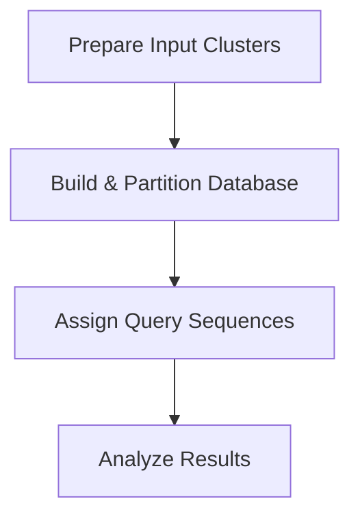
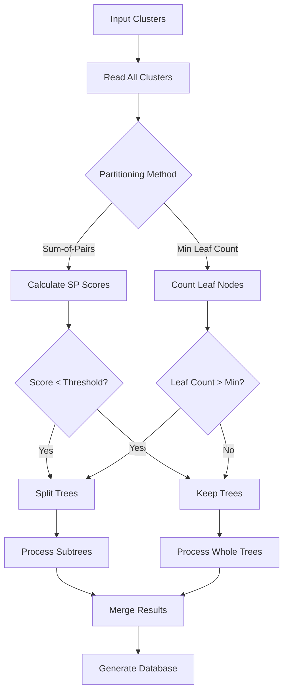
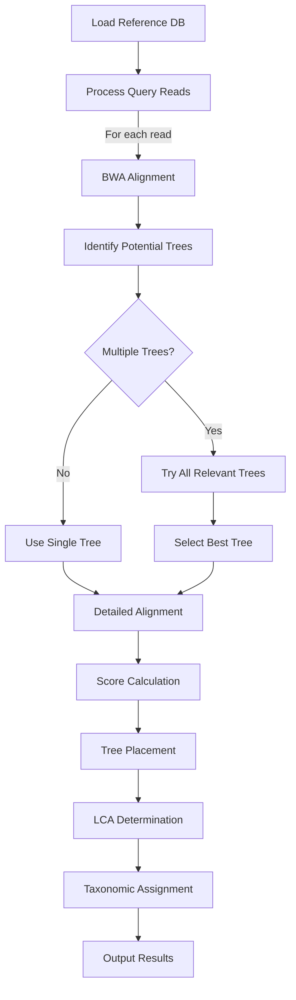

# Multiple Tree Workflow Example

This document walks through a complete workflow for taxonomic assignment using Tronko with multiple trees (partitioning), focusing on the data flow and key decision points.

## Overview

The multiple tree workflow in Tronko is appropriate for:
- Diverse taxonomic groups that cannot be accurately represented in a single tree
- Datasets with varying alignment quality across clades
- Large datasets (>1,000-2,000 sequences)
- Cases where MSA quality is unreliable



## Step 1: Prepare Input Clusters

Multiple tree workflow requires a directory containing cluster files:

### 1.1. Directory Structure

```
clusters_directory/
├── 1_MSA.fasta        # MSA for cluster 1
├── 2_MSA.fasta        # MSA for cluster 2
├── 3_MSA.fasta        # MSA for cluster 3
├── 1_taxonomy.txt     # Taxonomy for cluster 1
├── 2_taxonomy.txt     # Taxonomy for cluster 2
├── 3_taxonomy.txt     # Taxonomy for cluster 3
├── RAxML_bestTree.1.reroot    # Tree for cluster 1
├── RAxML_bestTree.2.reroot    # Tree for cluster 2
└── RAxML_bestTree.3.reroot    # Tree for cluster 3
```

### 1.2. File Format Requirements

Same as for single tree workflow, but consistent across all clusters:

- **MSA Files**: FASTA format, no line breaks within sequences
- **Tree Files**: Newick format, rooted trees
- **Taxonomy Files**: Tab-delimited, with consistent taxonomic levels

### 1.3. Naming Convention

Files must follow these naming conventions:
- MSA files: `[Number]_MSA.fasta`
- Taxonomy files: `[Number]_taxonomy.txt`
- Tree files: `RAxML_bestTree.[Number].reroot`

## Step 2: Build Reference Database with Partitioning

### 2.1. Partitioning Options

Tronko offers two partitioning approaches:

#### 2.1.1. Sum-of-Pairs Score Partitioning

```bash
tronko-build -y -e [CLUSTER_DIRECTORY] -n [NUMBER_OF_CLUSTERS] -d [OUTPUT_DIRECTORY] -s -u [THRESHOLD]
```

- **-y**: Use partition directory
- **-e**: Directory containing MSA, taxonomy, and tree files
- **-n**: Number of clusters in the directory
- **-s**: Use sum-of-pairs score for partitioning
- **-u**: Threshold for sum-of-pairs score (default: 0.5)

#### 2.1.2. Minimum Leaf Node Partitioning

```bash
tronko-build -y -e [CLUSTER_DIRECTORY] -n [NUMBER_OF_CLUSTERS] -d [OUTPUT_DIRECTORY] -v -f [MIN_LEAVES]
```

- **-v**: Use minimum leaf node count for partitioning
- **-f**: Minimum number of leaf nodes per partition

### 2.2. Example Commands

Using the example datasets:

**Example 1: Sum-of-Pairs Score Partitioning**:
```bash
tronko-build -y -e tronko-build/example_datasets/multiple_trees/one_MSA -n 1 \
             -d out_oneMSA -s
```

**Example 2: Minimum Leaf Node Partitioning**:
```bash
tronko-build -y -e tronko-build/example_datasets/multiple_trees/multiple_MSA -n 5 \
             -d outdir_multiple_MSA -v -f 500
```

### 2.3. Partitioning Process



### 2.4. Output Files

The primary output is `reference_tree.txt` in the specified output directory, containing:
- Multiple tree structures (one per partition)
- Node relationships within each tree
- Likelihood values
- Taxonomic information

## Step 3: Prepare Query Sequences

The preparation of query sequences is identical to the single tree workflow:

- Single-end reads in FASTA or FASTQ format
- Paired-end reads in two separate files

## Step 4: Run Taxonomic Assignment

### 4.1. Command Syntax

The assignment commands are the same as for single tree, but Tronko automatically handles multiple trees:

**Single-End Assignment**:
```bash
tronko-assign -r -f [REFERENCE_DB] -a [REFERENCE_FASTA] -s -g [READS_FILE] -o [OUTPUT_FILE] -w
```

**Paired-End Assignment**:
```bash
tronko-assign -r -f [REFERENCE_DB] -a [REFERENCE_FASTA] -p -1 [FORWARD_READS] -2 [REVERSE_READS] -o [OUTPUT_FILE] -w
```

### 4.2. Example Commands

Using the example datasets:

**Example with Partitioned Database**:
```bash
tronko-assign -r -f out_oneMSA/reference_tree.txt -s \
              -g example_datasets/multiple_trees/missingreads_singleend_150bp_2error.fasta \
              -o example_datasets/multiple_trees/missingreads_singleend_150bp_2error_partition_results.txt \
              -a tronko-build/example_datasets/multiple_trees/one_MSA/1.fasta
```

### 4.3. Multiple Tree Assignment Process



### 4.4. Tree Selection Process

For each read, Tronko evaluates which tree provides the best placement:

1. Initial BWA alignment identifies candidate trees
2. Each relevant tree is evaluated with detailed alignment
3. The tree providing the best score is selected
4. Taxonomic assignment proceeds using the selected tree
5. Tree number is recorded in the output

## Step 5: Analyze Assignment Results

### 5.1. Output Format

The output format is the same as for single tree, but includes tree numbers:

```
Readname    Taxonomic_Path    Score    Forward_Mismatch    Reverse_Mismatch    Tree_Number    Node_Number
```

### 5.2. Example Output

```
Sample1    Eukaryota;Chordata;Aves;Charadriiformes;Alcidae;Uria;Uria aalge    -54.258690    5.000000    4.00000    2    1095
Sample2    Eukaryota;Chordata;Aves;Charadriiformes;Alcidae;Uria;Uria aalge    -42.871226    1.000000    6.00000    0    1095
Sample3    Eukaryota;Arthropoda;Insecta;Lepidoptera;Papilionidae;Papilio    -59.952407    7.000000    3.00000    1    1098
```

### 5.3. Interpreting Tree Number

- **Tree_Number**: Indicates which partition provided the best placement
- Values range from 0 to (number of partitions - 1)
- Higher frequency of assignments to a particular tree may indicate taxonomic bias in the sample

## Step 6: Optimizing Partitioning Parameters

### 6.1. Sum-of-Pairs Score Threshold

The `-u` parameter controls partitioning aggressiveness with sum-of-pairs method:

- **Lower values** (e.g., 0.3): More aggressive partitioning, more trees
- **Higher values** (e.g., 0.7): Less aggressive partitioning, fewer trees
- **Default value** (0.5): Balanced approach

### 6.2. Minimum Leaf Node Count

The `-f` parameter sets the minimum partition size:

- **Lower values** (e.g., 100): Allows smaller partitions, more trees
- **Higher values** (e.g., 1000): Requires larger partitions, fewer trees
- **Optimal value**: Depends on dataset size and diversity

### 6.3. Choosing Between Partitioning Methods

- **Sum-of-Pairs**: Better for datasets with varying alignment quality
- **Minimum Leaf Node**: Better for very large datasets or when partition size control is critical

## Complete Workflow Example

Here's a complete example using multiple trees:

```bash
# Step 1: Build partitioned reference database
cd tronko
tronko-build -y -e tronko-build/example_datasets/multiple_trees/one_MSA -n 1 \
             -d out_oneMSA -s

# Step 2: Run assignment with single-end reads
tronko-assign -r -f out_oneMSA/reference_tree.txt -s \
              -g example_datasets/multiple_trees/missingreads_singleend_150bp_2error.fasta \
              -o example_datasets/multiple_trees/missingreads_singleend_150bp_2error_partition_results.txt \
              -a tronko-build/example_datasets/multiple_trees/one_MSA/1.fasta

# Step 3: View results
head example_datasets/multiple_trees/missingreads_singleend_150bp_2error_partition_results.txt
```

## Advantages of Multiple Tree Approach

1. **Improved Alignment Quality**: Each partition can have better alignment quality
2. **Enhanced Taxonomic Resolution**: Better discrimination between similar taxa
3. **Reduced Computational Requirements**: Smaller trees are more efficient to process
4. **Better Handling of Diverse Groups**: Can represent divergent clades more accurately

## When to Use Multiple Trees vs. Single Tree

- **Use Multiple Trees When**:
  - Working with diverse taxa across multiple domains/kingdoms
  - Having alignment quality issues in large MSAs
  - Dealing with very large datasets (thousands of sequences)
  - Needing to optimize taxonomic resolution for specific clades

- **Use Single Tree When**:
  - Working with well-defined taxonomic groups
  - Having high-quality MSAs
  - Processing smaller datasets (<1,000 sequences)
  - Prioritizing simplicity of workflow