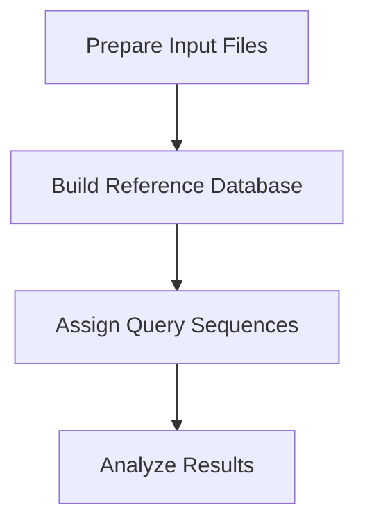
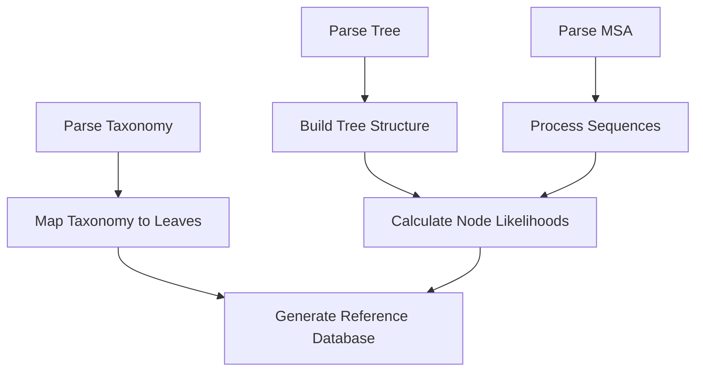
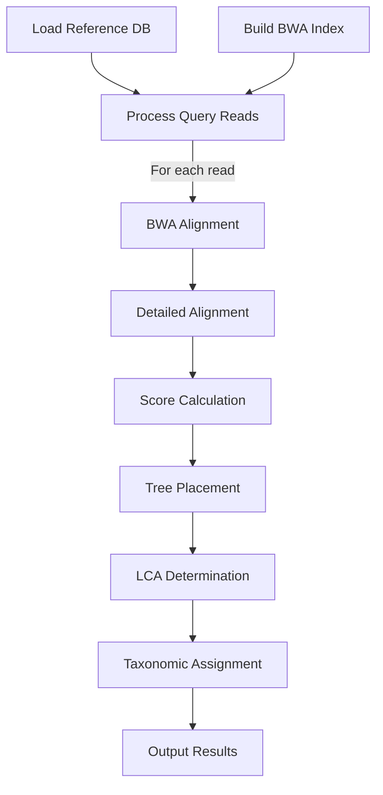

# Single Tree Workflow Example

This document walks through a complete workflow for taxonomic assignment using Tronko with a single reference tree, following the data flow from database building to assignment.

## Overview

The single tree workflow is the simplest approach in Tronko, appropriate for:
- Well-defined taxonomic groups
- High-quality MSAs with consistent alignment quality
- Datasets with fewer than 1,000-2,000 sequences



## Step 1: Prepare Input Files

Three input files are required for building a single-tree reference database:

### 1.1. Multiple Sequence Alignment (MSA)

The MSA contains aligned reference sequences in FASTA format:

```
>Sequence1
ACGTACGT--ACGTACGT
>Sequence2
ACGTACGTTAACGTACCT
>Sequence3
ACGTACGT--ACGTACTT
```

**File Format Requirements**:
- FASTA format
- No line breaks within sequences
- Sequence headers match exactly with tree and taxonomy files

### 1.2. Phylogenetic Tree

The phylogenetic tree in Newick format:

```
((Sequence1:0.1,Sequence2:0.2):0.05,Sequence3:0.15);
```

**File Format Requirements**:
- Newick format
- Rooted tree
- Taxa names match exactly with MSA and taxonomy files

### 1.3. Taxonomy File

The taxonomy file contains taxonomic paths for each sequence:

```
Sequence1    Eukaryota;Chordata;Aves;Passeriformes;Paridae;Parus;Parus major
Sequence2    Eukaryota;Chordata;Aves;Passeriformes;Paridae;Parus;Parus minor
Sequence3    Eukaryota;Chordata;Aves;Passeriformes;Fringillidae;Fringilla;Fringilla coelebs
```

**File Format Requirements**:
- Tab-delimited text file
- First column matches sequence headers in MSA
- Second column contains semicolon-delimited taxonomic path
- Consistent taxonomic levels across all entries

## Step 2: Build Reference Database

### 2.1. Command Syntax

For a single tree, use the `-l` option with `tronko-build`:

```bash
tronko-build -l -t [TREE_FILE] -m [MSA_FILE] -x [TAXONOMY_FILE] -d [OUTPUT_DIRECTORY]
```

### 2.2. Example Command

Using the Charadriiformes example dataset:

```bash
tronko-build -l -t example_datasets/single_tree/RAxML_bestTree.Charadriiformes.reroot \
             -m example_datasets/single_tree/Charadriiformes_MSA.fasta \
             -x example_datasets/single_tree/Charadriiformes_taxonomy.txt \
             -d example_datasets/single_tree/
```

### 2.3. Data Flow During Building



### 2.4. Output Files

The primary output is `reference_tree.txt` in the specified output directory, containing:
- Tree structure
- Node relationships
- Likelihood values
- Taxonomic information

## Step 3: Prepare Query Sequences

### 3.1. Single-End Reads

For single-end reads, prepare FASTA or FASTQ files:

```
>Read1
ACGTACGTACGTACGT
>Read2
ACGTACGTTAACGTAC
```

### 3.2. Paired-End Reads

For paired-end reads, prepare two files (forward and reverse):

**Forward Reads**:
```
>Read1/1
ACGTACGTACGTACGT
>Read2/1
ACGTACGTTAACGTAC
```

**Reverse Reads**:
```
>Read1/2
TGCATGCATGCATGCA
>Read2/2
TGCATGCAATTGCATG
```

## Step 4: Run Taxonomic Assignment

### 4.1. Single-End Assignment Command

For single-end reads:

```bash
tronko-assign -r -f [REFERENCE_DB] -a [REFERENCE_FASTA] -s -g [READS_FILE] -o [OUTPUT_FILE] -w
```

### 4.2. Paired-End Assignment Command

For paired-end reads:

```bash
tronko-assign -r -f [REFERENCE_DB] -a [REFERENCE_FASTA] -p -1 [FORWARD_READS] -2 [REVERSE_READS] -o [OUTPUT_FILE] -w
```

### 4.3. Example Commands

Using the example datasets:

**Single-End Example**:
```bash
tronko-assign -r -f example_datasets/single_tree/reference_tree.txt \
              -a example_datasets/single_tree/Charadriiformes.fasta \
              -s -g example_datasets/single_tree/missingreads_singleend_150bp_2error.fasta \
              -o example_datasets/single_tree/missingreads_singleend_150bp_2error_results.txt -w
```

**Paired-End Example**:
```bash
tronko-assign -r -f example_datasets/single_tree/reference_tree.txt \
              -a example_datasets/single_tree/Charadriiformes.fasta \
              -p -1 example_datasets/single_tree/missingreads_pairedend_150bp_2error_read1.fasta \
              -2 example_datasets/single_tree/missingreads_pairedend_150bp_2error_read2.fasta \
              -o example_datasets/single_tree/missingreads_pairedend_150bp_2error_results.txt -w
```

### 4.4. Data Flow During Assignment



## Step 5: Analyze Assignment Results

### 5.1. Output Format

The output is a tab-delimited text file with the following columns:

```
Readname    Taxonomic_Path    Score    Forward_Mismatch    Reverse_Mismatch    Tree_Number    Node_Number
```

### 5.2. Example Output

```
GU572157.1_8_1    Eukaryota;Chordata;Aves;Charadriiformes;Alcidae;Uria;Uria aalge    -54.258690    5.000000    4.00000    0    1095
GU572157.1_7_1    Eukaryota;Chordata;Aves;Charadriiformes;Alcidae;Uria;Uria aalge    -42.871226    1.000000    6.00000    0    1095
GU572157.1_6_1    Eukaryota;Chordata;Aves;Charadriiformes;Alcidae;Uria;Uria aalge    -59.952407    7.000000    3.00000    0    1098
```

### 5.3. Interpreting Results

- **Readname**: Original query read identifier
- **Taxonomic_Path**: Assigned taxonomic classification
- **Score**: Assignment score (higher/less negative is better)
- **Forward_Mismatch**: Number of mismatches in forward read alignment
- **Reverse_Mismatch**: Number of mismatches in reverse read alignment (0 for single-end)
- **Tree_Number**: Tree index (always 0 for single-tree databases)
- **Node_Number**: Node ID in the reference tree where the read was placed

## Step 6: Optimizing Parameters

### 6.1. Key Parameters for Tuning

- **LCA Cutoff** (-c): Controls assignment specificity (default: 5)
- **Alignment Method** (-w): Use for Needleman-Wunsch (omit for WFA2)
- **Thread Count** (-C): Number of parallel threads (default: 1)
- **Score Constant** (-u): Affects likelihood calculations (default: 0.01)

### 6.2. Parameter Experimentation

Try different LCA cutoffs to adjust the specificity/sensitivity balance:

```bash
# More specific assignments (potentially more errors)
tronko-assign ... -c 0

# Default balance
tronko-assign ... -c 5

# More conservative assignments (fewer errors, less specific)
tronko-assign ... -c 10
```

## Complete Workflow Example

Here's a complete example using the Charadriiformes dataset:

```bash
# Step 1: Build reference database
cd tronko
tronko-build -l -t example_datasets/single_tree/RAxML_bestTree.Charadriiformes.reroot \
             -m example_datasets/single_tree/Charadriiformes_MSA.fasta \
             -x example_datasets/single_tree/Charadriiformes_taxonomy.txt \
             -d example_datasets/single_tree/

# Step 2: Run assignment with paired-end reads
tronko-assign -r -f example_datasets/single_tree/reference_tree.txt \
              -a example_datasets/single_tree/Charadriiformes.fasta \
              -p -1 example_datasets/single_tree/missingreads_pairedend_150bp_2error_read1.fasta \
              -2 example_datasets/single_tree/missingreads_pairedend_150bp_2error_read2.fasta \
              -o example_datasets/single_tree/missingreads_pairedend_150bp_2error_results.txt -w

# Step 3: View results
head example_datasets/single_tree/missingreads_pairedend_150bp_2error_results.txt
```

## Performance Considerations

- **Memory Usage**: Primarily determined by the size of the reference database
- **CPU Usage**: Scales with the number of query reads and reference sequences
- **Disk Space**: Minimal requirements beyond input/output files
- **Runtime**: Typically seconds to minutes for example datasets, can be hours for large datasets