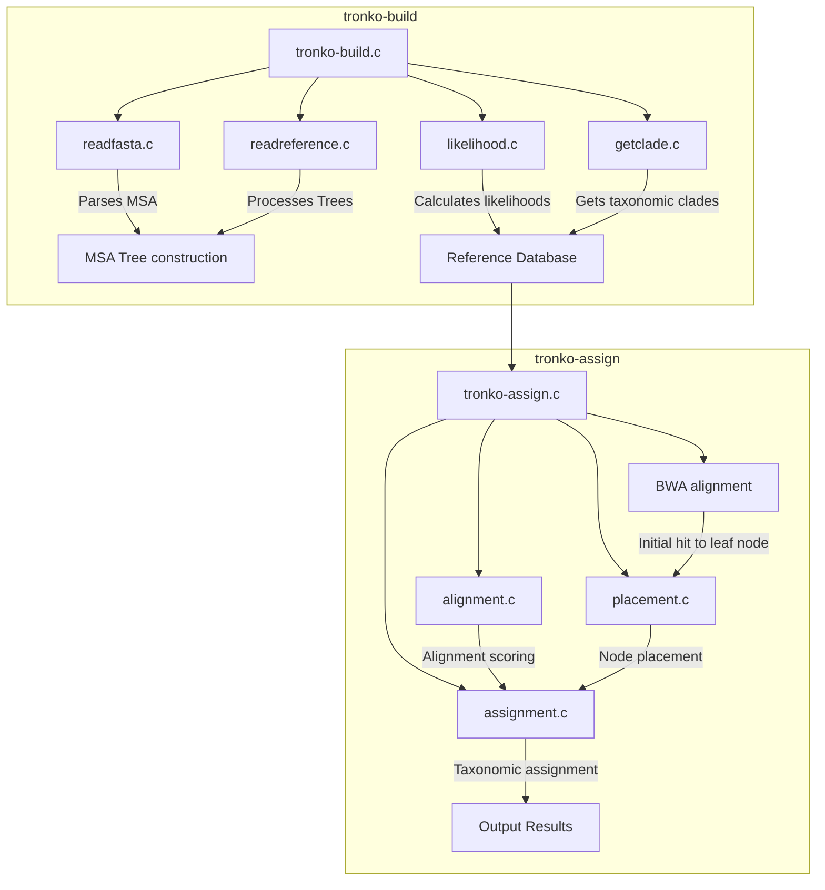

# Tronko Architecture Overview

[◀ Back to Documentation Home](../README.md) | [▶ Next: Workflow Overview](workflow.md)

## Introduction

Tronko is a phylogeny-based method for taxonomic classification of metabarcoding data. It consists of two main components: `tronko-build` and `tronko-assign`. This document provides a high-level overview of the system architecture, component relationships, and data flow.

## System Architecture

## Core Components

### tronko-build

- **Main Program (`tronko-build.c`)**: Coordinates the creation of reference databases
- **FASTA Reader (`readfasta.c`)**: Parses multiple sequence alignments
- **Reference Reader (`readreference.c`)**: Processes phylogenetic trees
- **Likelihood Calculator (`likelihood.c`)**: Computes node probabilities
- **Clade Extractor (`getclade.c`)**: Manages taxonomic information

### tronko-assign

- **Main Program (`tronko-assign.c`)**: Manages query sequence processing workflow
- **BWA Module**: Performs initial alignment to leaf nodes
- **Alignment Engine (`alignment.c`)**: Handles sequence alignment using either WFA2 or Needleman-Wunsch
- **Assignment Module (`assignment.c`)**: Performs taxonomic classification
- **Placement Module (`placement.c`)**: Places sequences on the phylogenetic tree

## External Dependencies

- **BWA**: Burrows-Wheeler Aligner for initial sequence mapping
- **WFA2**: Wavefront Alignment Algorithm for efficient sequence alignment
- **RAxML/FastTree**: Tools for phylogenetic tree construction

## Data Flow

1. **Database Building**:
   - Input: Multiple sequence alignments, taxonomic information, and phylogenetic trees
   - Processing: Tree partitioning, node likelihood calculation
   - Output: Reference database file containing tree structure and likelihood data

2. **Sequence Assignment**:
   - Input: Query reads and reference database
   - Processing: BWA alignment → WFA/Needleman-Wunsch alignment → Placement → LCA calculation
   - Output: Taxonomic assignments with scores

## Memory Model

Tronko uses a C-based memory model with manual allocation for efficiency:

- Custom memory allocators for tree structures
- Optimized memory handling for large sequence datasets
- Thread-safe memory management for parallel processing

## Threading Model

- `tronko-build`: Single-threaded for database construction
- `tronko-assign`: Multi-threaded for query processing with configurable thread count

## Communication Interfaces

- File-based interface between `tronko-build` and `tronko-assign`
- Standardized input/output formats for integration with bioinformatics pipelines