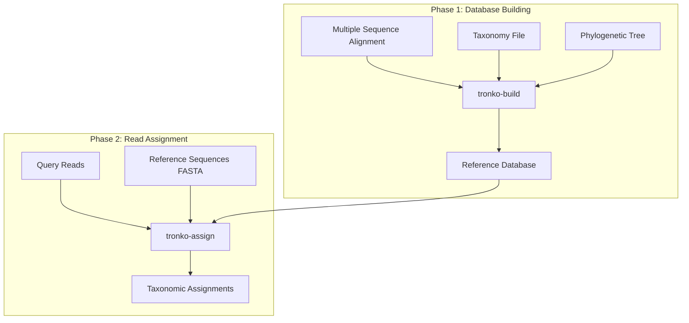
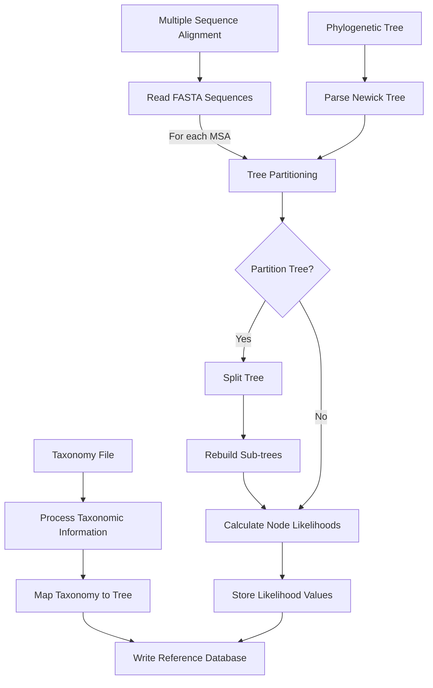
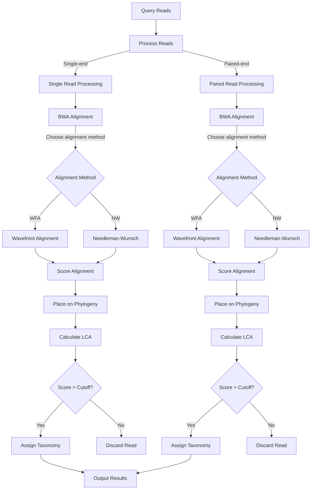

# Tronko Workflow

This document describes the end-to-end workflow of Tronko, from database building to taxonomic assignment, with a focus on data flow and processing steps.

## Overall Workflow

## tronko-build Workflow

## tronko-assign Workflow

## Information Flow Details

### 1. Database Building

1. **Input Files Processing**:
   - Multiple sequence alignment (MSA) in FASTA format is parsed
   - Phylogenetic tree in Newick format is processed
   - Taxonomy information is mapped to tree nodes

2. **Tree Partitioning** (optional):
   - Sum-of-pairs score or minimum leaf node count used to determine partitioning
   - Trees can be split into multiple sub-trees for more accurate alignment

3. **Likelihood Calculation**:
   - Fractional likelihoods calculated for all tree nodes
   - This is a key differentiator from traditional LCA methods that only use leaf nodes

4. **Output Generation**:
   - Reference database file containing tree structure, node likelihoods, and taxonomic information
   - Format optimized for efficient loading by tronko-assign

### 2. Read Assignment

1. **Read Processing**:
   - Handles both single-end and paired-end reads
   - Optional reverse complementing based on read orientation

2. **Initial Alignment**:
   - BWA used for fast mapping to leaf nodes in the reference tree
   - Provides initial positioning for more detailed alignment

3. **Detailed Alignment**:
   - Two options available:
     - Wavefront Alignment Algorithm (WFA2) - Faster, default option
     - Needleman-Wunsch - Traditional alignment algorithm

4. **Scoring and Placement**:
   - Alignment scores calculated based on matches/mismatches
   - Reads placed on the phylogenetic tree based on alignment scores

5. **LCA Calculation**:
   - Lowest Common Ancestor determined based on score cutoff
   - Critical filtering point: reads below threshold are discarded

6. **Output Generation**:
   - Tab-delimited results file with taxonomic assignments and scores
   - Includes mismatch information and tree/node placement details

## Read Filtering Conditions

Reads may be filtered out (discarded) at several points in the workflow:

1. **During BWA Alignment**:
   - Reads with no hits to reference sequences are discarded
   - Threshold determines minimum mapping quality

2. **During Score Evaluation**:
   - LCA cutoff parameter (-c) determines the score threshold
   - Reads with scores below the threshold are assigned to higher taxonomic levels or discarded

3. **During Taxonomic Assignment**:
   - Reads that cannot be confidently assigned to any taxonomic level are discarded

## Key Parameters Affecting Workflow

- **LCA Cutoff** (-c): Controls the stringency of taxonomic assignment
- **Alignment Method** (-w): Selects between WFA (default) or Needleman-Wunsch
- **Thread Count** (-C): Number of parallel processing threads
- **Score Constant** (-u): Affects likelihood calculations (default: 0.01)