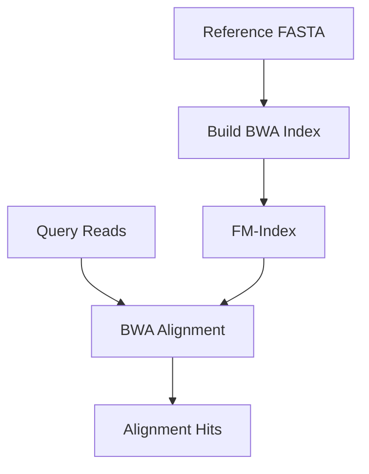
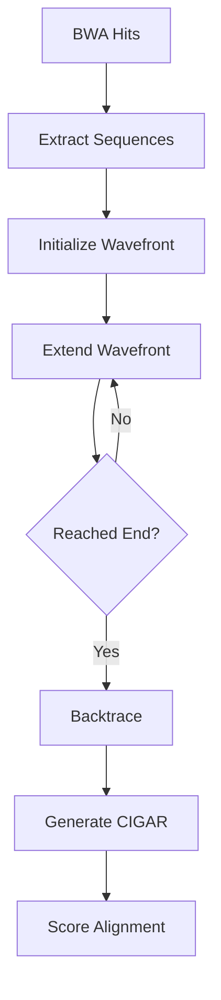
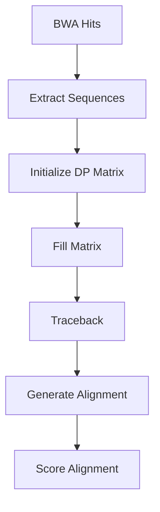

# Sequence Alignment Methods in Tronko

[◀ Back to Documentation Home](../README.md) | [◀ Previous: Assignment Algorithm](assignment_algorithm.md) | [▶ Next: Scoring System](scoring_system.md)

This document explains the sequence alignment methods used in `tronko-assign` and their impact on taxonomic classification.

## Overview of Alignment in Tronko

Tronko uses a two-step alignment process:

1. **Initial Alignment**: BWA aligns query reads to reference sequences
2. **Detailed Alignment**: Either WFA2 or Needleman-Wunsch performs more precise alignment

This two-step approach balances speed and accuracy, using BWA for rapid initial positioning and a more sensitive alignment algorithm for precise scoring.

## Initial Alignment with BWA

### BWA Algorithm Overview

Burrows-Wheeler Aligner (BWA) uses the Burrows-Wheeler Transform (BWT) and FM-index to efficiently align short reads to a reference genome:



### Implementation in Tronko

Tronko incorporates BWA as an embedded library:

1. Reference sequences are indexed using `bwa index`
2. The BWA mem algorithm performs the alignment
3. Alignment results are filtered based on quality

**Key Files**:
- `bwa_source_files/bwamem.c`: Core alignment algorithm
- `bwa_source_files/bntseq.c`: Index handling
- `tronko-assign.c`: BWA invocation and result processing

### BWA Parameters

The BWA alignment in Tronko uses these key parameters:

- **Match Score**: Score for matching bases
- **Mismatch Penalty**: Penalty for mismatching bases
- **Gap Open Penalty**: Penalty for opening a gap
- **Gap Extension Penalty**: Penalty for extending a gap

## Detailed Alignment Methods

Tronko offers two algorithms for detailed alignment:

### 1. WFA2 (Wavefront Alignment Algorithm)

The default method, WFA2 is a modern alignment algorithm that offers significant speed advantages:



#### Key Features of WFA2

1. **Wavefront Representation**: Uses wavefronts to represent alignment states
2. **Gap-Affine Model**: Supports gap-affine alignment
3. **Memory Efficiency**: Optimized memory usage for long sequences
4. **SIMD Acceleration**: Uses SIMD instructions where available

#### Implementation in Tronko

The WFA2 algorithm is integrated from the WFA2 library:

**Key Files**:
- `WFA2/wavefront_align.c`: Core alignment function
- `WFA2/wavefront_compute.c`: Wavefront computation
- `alignment.c`: WFA2 invocation in Tronko

### 2. Needleman-Wunsch (NW)

An alternative method, NW is a classic global alignment algorithm:



#### Key Features of NW

1. **Dynamic Programming**: Uses a matrix to find optimal alignment
2. **Global Alignment**: Aligns entire sequences end-to-end
3. **Guaranteed Optimality**: Finds the mathematically optimal alignment
4. **Intuitive**: Easier to understand and debug

#### Implementation in Tronko

The NW algorithm is implemented directly in Tronko:

**Key Files**:
- `needleman_wunsch.c`: NW implementation
- `alignment.c`: NW invocation

## Comparison of Alignment Methods

| Aspect | WFA2 | Needleman-Wunsch |
|--------|------|------------------|
| Speed | Faster | Slower |
| Memory Usage | Lower | Higher |
| Alignment Type | Global | Global |
| Complexity | O(ns) | O(nm) |
| Implementation | External library | Custom |

Where:
- n and m are sequence lengths
- s is edit distance between sequences

## Alignment Scoring

Regardless of the alignment method used, the resulting alignments are scored using a common system:

### Scoring Formula

```
score = matches - (mismatches * mismatch_penalty) - (gaps * gap_penalty)
```

### Normalization

Scores are normalized based on alignment length to allow fair comparison between sequences of different lengths:

```
normalized_score = raw_score / alignment_length
```

### Paired-End Handling

For paired-end reads, the scores from both reads are combined:

```
combined_score = (forward_score + reverse_score) / 2
```

## Alignment Parameters

The alignment behavior can be customized through several parameters:

1. **Match Score**: Reward for matching bases (default: 2)
2. **Mismatch Penalty**: Penalty for mismatching bases (default: 1)
3. **Gap Open Penalty**: Penalty for opening a gap (default: 5)
4. **Gap Extension Penalty**: Penalty for extending a gap (default: 2)

## Selecting the Right Alignment Method

The choice between WFA2 and NW depends on your specific needs:

- **Use WFA2 (default) when**:
  - Processing large datasets
  - Speed is critical
  - Memory is limited

- **Use NW (with -w flag) when**:
  - Absolute accuracy is critical
  - Debugging specific alignments
  - Comparing to other Needleman-Wunsch implementations

## Impact on Taxonomic Assignment

The alignment method affects taxonomic assignment in several ways:

1. **Alignment Accuracy**: More accurate alignments lead to better taxonomic placement
2. **Sensitivity to Variations**: Different methods may handle variations differently
3. **Processing Time**: Faster alignment enables processing of larger datasets

## Implementation Details

### Memory Management

Both alignment methods use custom memory management for efficiency:

- WFA2 uses a custom memory allocator (`mm_allocator`)
- NW uses pre-allocated matrices to avoid repeated allocation

### Parallelization

Alignment operations are parallelized in Tronko:

- Multiple threads can process different reads simultaneously
- Thread count is controlled via the `-C` parameter