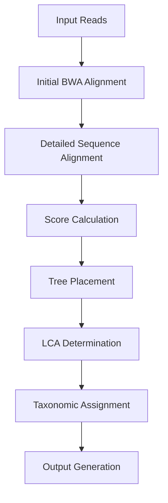
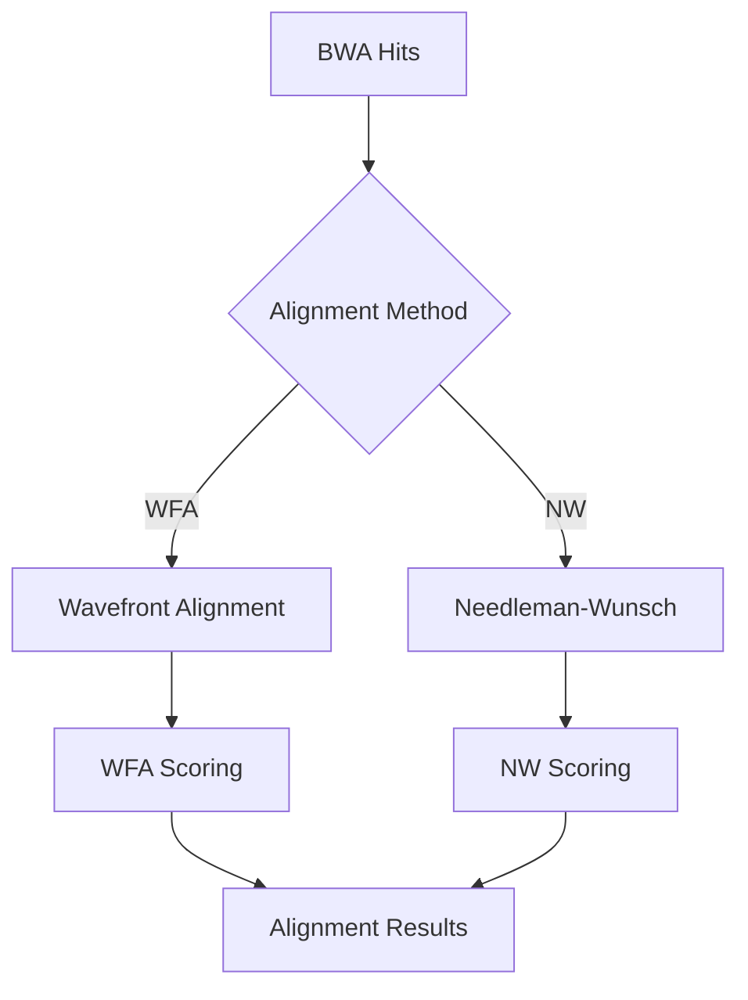
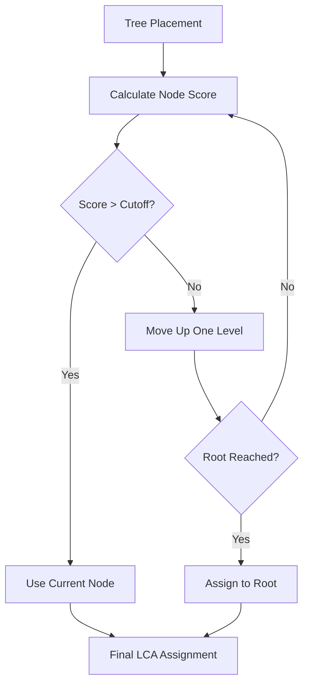

# Taxonomic Assignment Algorithm in Tronko

This document explains the core taxonomic assignment algorithm used in `tronko-assign`, including the workflow, scoring mechanisms, and decision points.

## Algorithm Overview

The taxonomic assignment process in Tronko follows these major steps:



## Step 1: Initial BWA Alignment

The first step uses BWA (Burrows-Wheeler Aligner) to rapidly identify the most likely leaf nodes for each query sequence:

1. BWA index is created from the reference FASTA file
2. Each query read is aligned against the reference database
3. Alignment hits are filtered based on minimum mapping quality
4. Top hits are selected for further analysis

**Key Implementation**: The BWA alignment is performed using the bundled BWA library in `bwa_source_files/`, with primary logic in `tronko-assign.c`.

## Step 2: Detailed Sequence Alignment

For each BWA hit, a more detailed alignment is performed using either:

1. **Wavefront Alignment Algorithm (WFA2)** - Default, faster option
2. **Needleman-Wunsch (NW)** - Alternative, more traditional algorithm



**Key Implementation**: 
- WFA is implemented using the WFA2 library in the `WFA2/` directory
- NW is implemented in `needleman_wunsch.c`
- Alignment logic is coordinated in `alignment.c`

## Step 3: Score Calculation

Alignment scores are calculated based on matches, mismatches, and gaps:

1. For each alignment, a raw score is calculated
2. Scores are normalized based on alignment length
3. For paired-end reads, forward and reverse scores are combined

**Scoring Formula**:
```
score = matches - (mismatches * mismatch_penalty) - (gaps * gap_penalty)
```

**Key Implementation**: Scoring logic is in `alignment_scoring.c` with parameters defined in `alignment.h`.

## Step 4: Tree Placement

Using the alignment scores and the precomputed likelihood values from the reference database:

1. Each read is placed at the optimal position in the tree
2. For multiple trees (partitioned database), the best tree is selected
3. Fractional likelihoods are used to evaluate all possible placements

**Key Implementation**: Placement logic is in `placement.c`.

## Step 5: LCA Determination

The Lowest Common Ancestor (LCA) is determined:



**Key Parameters**:
- **LCA Cutoff** (-c): Controls how aggressively reads move up the tree (default: 5)
- **Score Constant** (-u): Affects likelihood calculations (default: 0.01)

**Key Implementation**: LCA calculation is in `assignment.c`.

## Step 6: Taxonomic Assignment

The taxonomic path is determined based on the LCA node:

1. For leaf nodes, the full taxonomy is used
2. For internal nodes, the taxonomy is truncated to the appropriate level
3. The taxonomic path is formatted as a semicolon-delimited string

**Key Implementation**: Taxonomy assignment is in `assignment.c`.

## Step 7: Output Generation

Results are written to the output file in tab-delimited format:

```
Readname  Taxonomic_Path  Score  Forward_Mismatch  Reverse_Mismatch  Tree_Number  Node_Number
```

**Key Implementation**: Output generation is in `tronko-assign.c` and `printAlignments.c`.

## Read Filtering and Discarding

Reads may be filtered out (discarded) at several points:

### During BWA Alignment
- Reads with no hits to reference sequences
- Reads with mapping quality below threshold

### During Score Evaluation
- Reads with alignment scores below critical thresholds
- Poorly aligned reads that would be assigned to very high taxonomic levels

### Decision Criteria for Discarding
```
if (alignment_score < minimum_threshold || node_level > maximum_acceptable_level) {
    discard_read();
} else {
    assign_taxonomy();
}
```

## Algorithm Parameters and Customization

The assignment algorithm can be tuned with several parameters:

1. **LCA Cutoff** (-c): Controls the stringency of taxonomic assignment
2. **Alignment Method** (-w): Selects between WFA (default) or Needleman-Wunsch
3. **Score Constant** (-u): Affects likelihood calculations
4. **Thread Count** (-C): Number of parallel processing threads

## Paired-end vs. Single-end Processing

The algorithm handles both paired-end and single-end reads:

### Single-end
- Each read is processed independently
- Only forward alignment score is considered

### Paired-end
- Forward and reverse reads are processed together
- Paired scores are combined for placement decisions
- Both reads must support the same taxonomic assignment

## Implementation Notes

1. **Threading Model**: The assignment process is parallelized by processing batches of reads concurrently
2. **Memory Management**: Custom memory allocation strategies are used for efficiency
3. **Error Handling**: Various checks ensure robustness against problematic reads

## Algorithm Complexity

- **Time Complexity**: O(n * m * log(k)) where n is the number of reads, m is the average read length, and k is the number of reference sequences
- **Space Complexity**: O(r + t) where r is the size of the reference database and t is the size of the tree structure