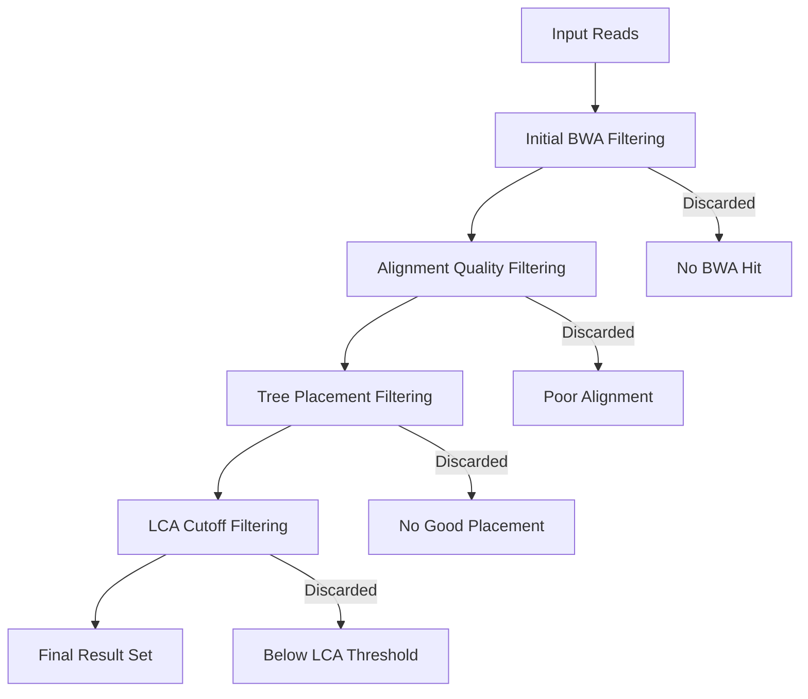
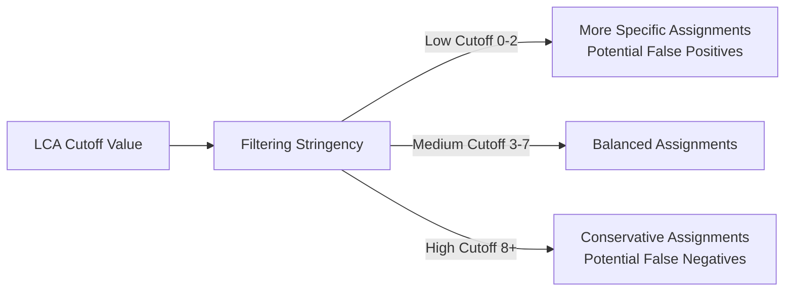
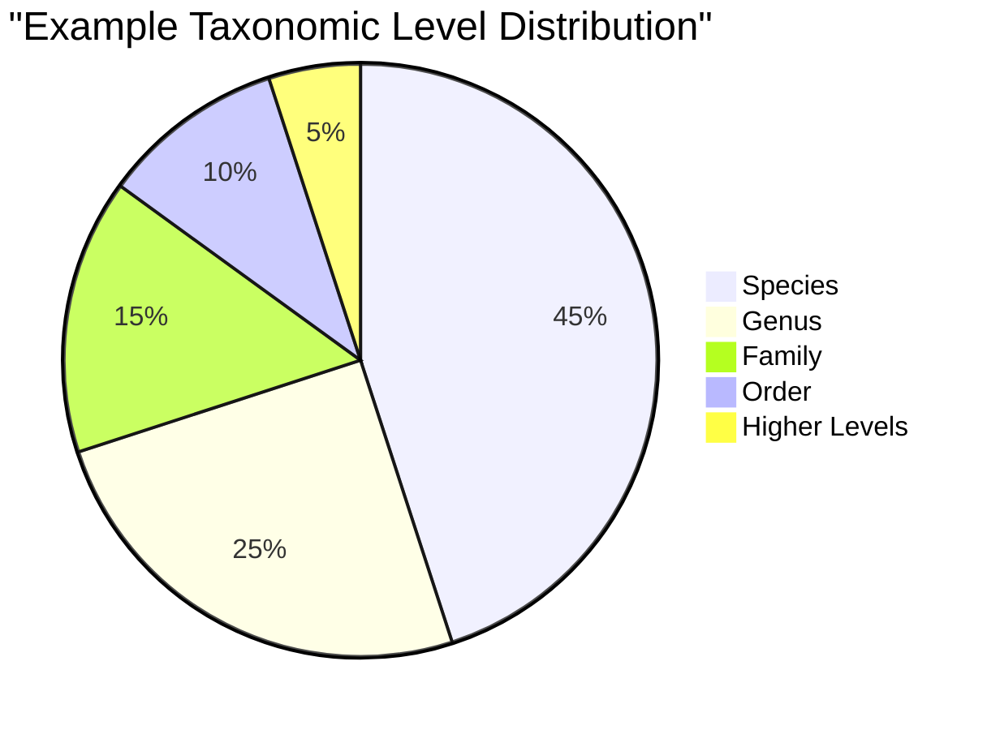

# Filtering Criteria in Tronko

[◀ Back to Documentation Home](../README.md) | [◀ Previous: Scoring System](scoring_system.md) | [▶ Next: Single Tree Workflow](../examples/single_tree_workflow.md)

This document describes the filtering mechanisms used in Tronko to determine which reads are assigned taxonomic classifications and which are discarded. It explains the various filtering points, criteria, and parameters that affect filtering decisions.

## Overview of Filtering in Tronko

Filtering is essential for ensuring high-quality taxonomic assignments. Tronko incorporates multiple filtering stages throughout the assignment process:



## Filtering Stages

### 1. Initial BWA Filtering

The first filtering stage occurs during BWA alignment:

**Criteria**:
- Reads with no hits to the reference database are discarded
- Reads with mapping quality below threshold are filtered out

**Implementation**:
```c
if (bwa_hit == NULL || bwa_hit->mapq < MIN_MAPQ) {
    // Discard read
    continue;
}
```

**Key Parameters**:
- Minimum mapping quality (internal parameter)
- Maximum number of hits to consider (internal parameter)

### 2. Alignment Quality Filtering

After detailed alignment (WFA or Needleman-Wunsch), alignments are filtered based on quality:

**Criteria**:
- Alignments with excessive gaps or mismatches may be discarded
- Alignments below minimum length threshold are filtered out
- Alignments with scores below critical thresholds are discarded

**Implementation**:
```c
if (alignment_score < MIN_ALIGNMENT_SCORE || 
    alignment_length < MIN_ALIGNMENT_LENGTH ||
    gap_percentage > MAX_GAP_PERCENTAGE) {
    // Discard read
    continue;
}
```

**Key Parameters**:
- Minimum alignment score (internal parameter)
- Minimum alignment length (internal parameter)
- Maximum gap percentage (internal parameter)

### 3. Tree Placement Filtering

During tree placement, reads that cannot be confidently placed on the tree are filtered:

**Criteria**:
- Reads with ambiguous placement across multiple trees are evaluated carefully
- Placements with extremely low likelihood values may be discarded
- For paired-end reads, inconsistent placements between pairs may be filtered

**Implementation**:
```c
if (best_placement_score < MIN_PLACEMENT_SCORE || 
    (paired_reads && placement_consistency < CONSISTENCY_THRESHOLD)) {
    // Discard read
    continue;
}
```

**Key Parameters**:
- Minimum placement score (internal parameter)
- Placement consistency threshold for paired reads (internal parameter)

### 4. LCA Cutoff Filtering

The most significant user-controlled filtering mechanism is the LCA cutoff:

**Criteria**:
- For each node in the tree, the score is compared to the cutoff threshold
- If below threshold, the assignment moves up to the parent node
- This process continues until either a node exceeds the threshold or the root is reached
- Assignments that can only be made at very high taxonomic levels may be discarded

**Implementation**:
```c
while (node != root && node_score <= LCA_CUTOFF) {
    node = node->parent;
    node_score = calculate_score(node);
}

if (node == root && taxonomic_level_too_high) {
    // Discard or flag as low-confidence
}
```

**Key Parameters**:
- LCA cutoff (-c parameter, default: 5)
- Maximum acceptable taxonomic level (internal parameter)

## User-Configurable Filtering Parameters

### LCA Cutoff (-c)

This is the primary parameter users can adjust to control filtering stringency:

- **Lower values** (e.g., 0-2): Less stringent filtering, more reads assigned at specific levels
- **Higher values** (e.g., 10-20): More stringent filtering, fewer specific assignments
- **Default value** (5): Balances specificity and accuracy



### Score Constant (-u)

This parameter indirectly affects filtering by modifying how scores are calculated:

- **Default value**: 0.01
- **Effect**: Modifies the relationship between alignment scores and node likelihoods

## Internal Filtering Parameters

Several internal parameters also affect filtering but are not directly configurable via command-line options:

### Alignment Parameters

- **Match score**: Reward for matching bases
- **Mismatch penalty**: Penalty for mismatches
- **Gap penalties**: Penalties for opening and extending gaps
- **Minimum alignment length**: Threshold for considering an alignment

### BWA Parameters

- **Minimum mapping quality**: Threshold for initial BWA alignment
- **Maximum number of hits**: Limit on considered reference sequences

### Tree Placement Parameters

- **Minimum placement score**: Threshold for valid tree placement
- **Maximum taxonomic level**: Highest acceptable classification level

## Read Disposition Tracking

Tronko does not explicitly track discarded reads in the standard output. However, the filtering process can be analyzed by:

1. Counting input reads vs. output assignments
2. Using debug output (when available) to identify filtering reasons
3. Modifying parameters to observe changes in assignment rates

## Filtering Effects on Results

The filtering criteria have significant impacts on assignment results:

### Assignment Rate

The percentage of reads receiving taxonomic assignments depends on filtering stringency:

```
assignment_rate = assigned_reads / total_reads * 100%
```

Typical values range from 70-95% depending on:
- Sample quality
- Reference database completeness
- Filtering parameter choices

### Taxonomic Resolution

Filtering affects the distribution of taxonomic levels in assignments:



Stricter filtering typically shifts this distribution toward higher taxonomic levels.

### Confidence vs. Coverage Trade-offs

Users must balance:
- **High confidence**: Stricter filtering, fewer but more reliable assignments
- **High coverage**: Relaxed filtering, more assignments but potentially less reliable

## Best Practices for Filtering

### Recommended Parameter Settings

| Dataset Quality | LCA Cutoff | Score Constant | Expected Assignment Rate |
|-----------------|------------|--------------|--------------------------|
| High (low error, close references) | 0-2 | 0.01 | 90-95% |
| Medium (typical metabarcoding) | 3-7 | 0.01 | 80-90% |
| Challenging (high error, divergent) | 8-15 | 0.01 | 70-85% |

### Parameter Optimization Strategy

To optimize filtering parameters:
1. Run with default settings
2. Evaluate assignment rate and taxonomic distribution
3. Adjust LCA cutoff to achieve desired specificity/sensitivity balance
4. Validate results with control samples or known compositions

## Example Filtering Scenarios

### Scenario 1: High-Confidence Filtering

```
- LCA cutoff: 10
- Result: ~75% of reads assigned, mostly at genus level or higher
- Application: Critical applications where false positives are costly
```

### Scenario 2: Balanced Filtering

```
- LCA cutoff: 5 (default)
- Result: ~85% of reads assigned, mixed taxonomic levels
- Application: General-purpose metabarcoding studies
```

### Scenario 3: High-Coverage Filtering

```
- LCA cutoff: 0
- Result: ~95% of reads assigned, many at species level
- Application: Exploratory studies where missing assignments is costly
```

## Implementation Details

### Filter Implementation Code

The filtering logic is implemented across several files:

- `tronko-assign.c`: BWA filtering
- `alignment.c`: Alignment quality filtering
- `placement.c`: Tree placement filtering
- `assignment.c`: LCA cutoff filtering

### Improving Filtering Results

To improve results without changing core filtering logic:

1. Ensure proper read orientation (use -v or -z as needed)
2. Use paired-end reads when available
3. Build custom reference databases for specific applications
4. Pre-filter low-quality reads before Tronko processing