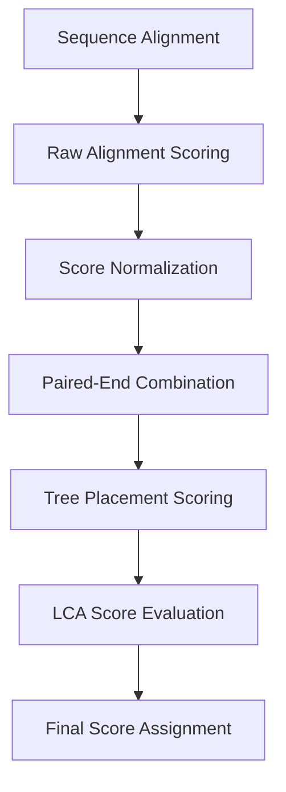
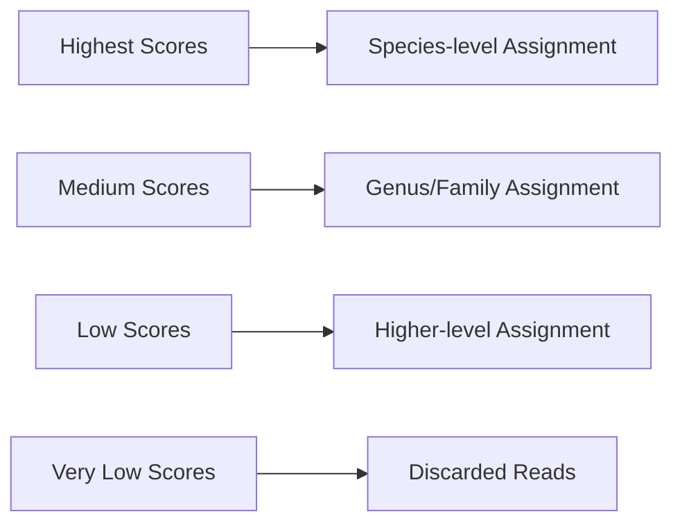

# Scoring System in Tronko

This document explains the scoring mechanisms used in Tronko for taxonomic assignment, including how scores are calculated, interpreted, and used for filtering.

## Overview of Scoring in Tronko

Scoring in Tronko is central to the taxonomic assignment process. It serves several important purposes:

1. **Quantifying Alignment Quality**: Measuring how well a query sequence matches reference sequences
2. **Determining Taxonomic Level**: Setting the appropriate taxonomic resolution
3. **Filtering Poor Assignments**: Discarding ambiguous or low-confidence assignments
4. **Ranking Multiple Hits**: Selecting the best assignment when multiple options exist

## Score Calculation Process

The scoring process involves multiple steps:



## Alignment Score Calculation

### Raw Alignment Score

For both alignment methods (WFA2 and Needleman-Wunsch), the raw alignment score is calculated as:

```
raw_score = matches - (mismatches * mismatch_penalty) - (gaps * gap_penalty)
```

Where:
- `matches` is the number of matching positions
- `mismatches` is the number of mismatching positions
- `gaps` is the number of gaps in the alignment
- `mismatch_penalty` and `gap_penalty` are configurable parameters

**Implementation**: This calculation is performed in `alignment_scoring.c`

### Score Normalization

Raw scores are normalized to account for sequence length:

```
normalized_score = raw_score / alignment_length
```

This ensures fair comparison between sequences of different lengths.

### Paired-End Score Combination

For paired-end reads, the scores from both reads are combined:

```
combined_score = (forward_score + reverse_score) / 2
```

Alternative combination methods (such as weighted combinations) may be used in specific cases.

## Tree Placement Scoring

### Likelihood-Based Scoring

The tree placement process uses the precomputed likelihood values from the reference database:

```
placement_score = alignment_score * node_likelihood_value
```

This rewards placements at nodes with high likelihood values.

### Multiple Tree Handling

For databases with multiple trees (partitions), all trees are evaluated:

```
best_tree_score = max(placement_score_tree_1, placement_score_tree_2, ...)
```

The tree with the highest placement score is selected.

## LCA Determination and Score Thresholds

### LCA Calculation

The Lowest Common Ancestor (LCA) determination uses scores to decide taxonomic level:

```
if (node_score > cutoff_threshold) {
    // Use current node
} else {
    // Move up one level in the tree
}
```

### Cutoff Parameter

The LCA cutoff parameter (`-c`) is critical for controlling assignment specificity:

- **Lower values** (e.g., 0): More specific assignments but potentially more errors
- **Higher values** (e.g., 10): More conservative assignments at higher taxonomic levels
- **Default value** (5): Balances specificity and accuracy

## Final Score in Output

The final score reported in the output file is:

```
final_score = best_placement_score
```

For paired-end reads, this incorporates both forward and reverse alignment information.

## Interpretation of Scores

### Score Range

Scores in Tronko are typically negative values, with:

- **Higher (less negative) scores**: Better alignment quality
- **Lower (more negative) scores**: Poorer alignment quality

### Score Magnitude

The absolute magnitude of scores depends on:

1. Sequence length
2. Number of mismatches
3. Number of gaps
4. Scoring parameters

### Taxonomic Resolution Correlation

There is a strong correlation between scores and taxonomic resolution:



## Filtering Based on Scores

### Scoring Thresholds

Several thresholds may filter out low-quality assignments:

1. **Minimum BWA Score**: Initial filter for BWA alignments
2. **Minimum Placement Score**: Threshold for considering a placement
3. **LCA Cutoff**: Parameter controlling taxonomic specificity

### Discarding Criteria

Reads are discarded when:

```
if (best_score < absolute_minimum_threshold || 
    assigned_taxonomic_rank > maximum_acceptable_rank) {
    discard_read();
}
```

### Score Reporting for Discarded Reads

Discarded reads are typically not included in the output file, but may be logged separately for debugging purposes.

## Score Parameters and Customization

### Key Parameters Affecting Scoring

1. **LCA Cutoff** (`-c`): Controls the score threshold for LCA determination
2. **Score Constant** (`-u`): Affects likelihood calculations (default: 0.01)
3. **Alignment Method** (`-w`): Affects how alignment scores are calculated

### Customizing the Scoring System

Users can customize the scoring behavior through:

1. Command-line parameters
2. Modifying alignment scoring parameters in the code
3. Adjusting the LCA determination algorithm

## Example Scoring Scenarios

### High-Confidence Assignment

```
- Forward read alignment score: -15.3
- Reverse read alignment score: -12.7
- Combined score: -14.0
- Node likelihood value: 0.85
- Placement score: -11.9
- Above LCA cutoff: Yes
- Assigned taxonomic level: Species
```

### Medium-Confidence Assignment

```
- Forward read alignment score: -24.8
- Reverse read alignment score: -28.1
- Combined score: -26.45
- Node likelihood value: 0.62
- Placement score: -16.4
- Above LCA cutoff: No (at species level), Yes (at genus level)
- Assigned taxonomic level: Genus
```

### Low-Confidence/Discarded Assignment

```
- Forward read alignment score: -42.3
- Reverse read alignment score: -39.7
- Combined score: -41.0
- Node likelihood value: 0.31
- Placement score: -12.71
- Above LCA cutoff: No (at all levels below order)
- Assigned taxonomic level: Order (or potentially discarded)
```

## Implementation Details

### Score Calculation Code

The core scoring functionality is implemented in:

- `alignment_scoring.c`: Basic alignment scoring
- `placement.c`: Tree placement scoring
- `assignment.c`: LCA determination and final score assignment

### Memory Representation

Scores are typically represented as double-precision floating-point values to accommodate the wide range of possible scores.