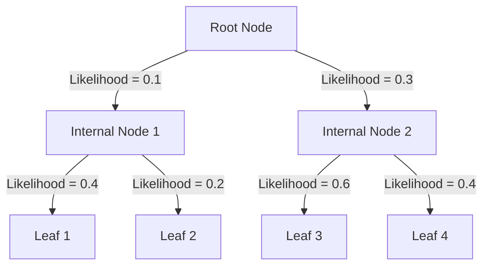

# Likelihood Calculation in Tronko

[◀ Back to Documentation Home](../README.md) | [◀ Previous: Database Format](database_format.md) | [▶ Next: Tree Partitioning](tree_partitioning.md)

This document explains the likelihood calculation process used in Tronko, a key differentiator from other taxonomic assignment methods.

## Conceptual Overview

Traditional methods for taxonomic assignment only use information from leaf nodes (individual sequences) in a phylogenetic tree. Tronko's innovation is calculating and storing fractional likelihoods for all nodes in the tree, including internal nodes, enabling more accurate taxonomic assignment.

As shown in the overview diagram below, this approach allows Tronko to place reads in their most likely position on the entire tree, rather than just assigning to known reference sequences.



## Likelihood Definition

In Tronko, the likelihood represents the probability that a sequence belongs to a specific node in the phylogenetic tree. For internal nodes, this represents the probability that the sequence belongs to the clade represented by that node.

## Calculation Process

The likelihood calculation process involves several steps:

1. **Tree Traversal**: The tree is traversed from leaf nodes to the root
2. **Likelihood Initialization**: Leaf nodes are initialized with likelihood values
3. **Internal Node Calculation**: Internal node likelihoods are computed based on child nodes
4. **Normalization**: Values are normalized to ensure proper probability distribution

## Mathematical Foundation

The likelihood calculation is based on phylogenetic principles:

### For Leaf Nodes

The likelihood for leaf nodes is determined by the reference sequence itself.

### For Internal Nodes

For an internal node with n children, the likelihood L is calculated as:

```
L_internal = Σ(w_i * L_child_i) for i=1 to n
```

Where:
- `L_internal` is the likelihood for the internal node
- `L_child_i` is the likelihood of the i-th child node
- `w_i` is the weight factor for the i-th child node (derived from branch lengths)

### Normalization

To ensure valid probability distributions, likelihoods are normalized:

```
L_normalized(node) = L(node) / Σ(L(all_nodes))
```

## Implementation in Code

The likelihood calculation is implemented in `likelihood.c` and involves the following key functions:

1. **initializeLikelihoods()**: Sets up initial values
2. **calculateNodeLikelihood()**: Core calculation function
3. **propagateLikelihoods()**: Propagates values up the tree
4. **normalizeLikelihoods()**: Ensures proper probability distributions

## Tree Partitioning Effect on Likelihoods

When trees are partitioned (via the sum-of-pairs or minimum leaf node approaches), each partition maintains its own likelihood values. This allows more accurate calculations for divergent clades.

## Practical Implications

The fractional likelihood approach has several advantages:

1. **Novel Sequence Handling**: Better placement of sequences not identical to reference database entries
2. **Taxonomic Resolution**: More precise assignment at higher taxonomic levels
3. **Confidence Metrics**: The likelihood values serve as built-in confidence scores

## Effect of Parameters

Several parameters affect the likelihood calculations:

1. **Score Constant** (-u): Directly impacts likelihood calculation (default: 0.01)
2. **Tree Partitioning**: Affects likelihood distribution across partitions
3. **LCA Cutoff** (-c): Determines how likelihoods are used in taxonomic assignment

## Verification

The likelihood values can be verified by:

1. Checking that all values are positive
2. Ensuring normalized values sum to 1.0
3. Confirming that the likelihood distribution makes biological sense (higher values for closely related sequences)

## Example Calculation

Consider a simple tree with a root node, two internal nodes, and four leaf nodes:

1. Assign initial likelihoods to leaf nodes based on sequence similarity
2. Calculate internal node likelihoods by weighted averaging of child nodes
3. Propagate values up to the root node
4. Normalize all values to create a proper probability distribution
5. Store these values in the reference database for use by tronko-assign