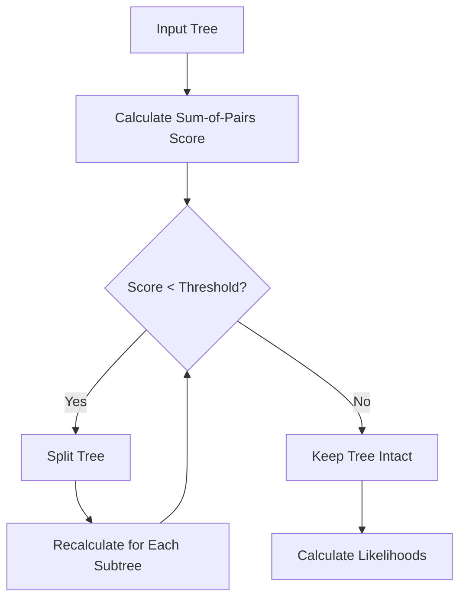
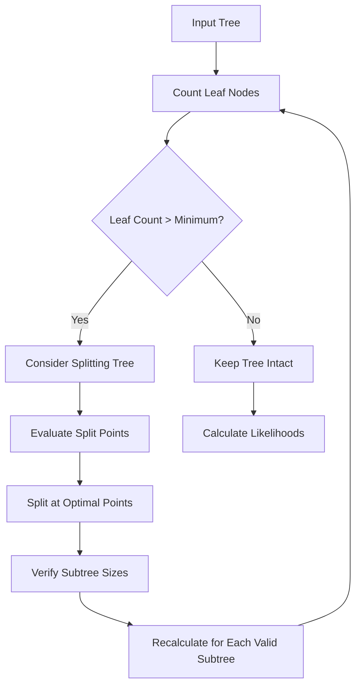
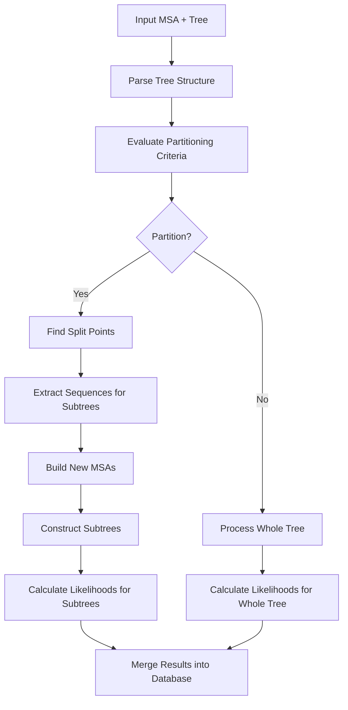

# Tree Partitioning in Tronko

This document explains the tree partitioning process in `tronko-build`, which is a critical feature for handling large and diverse reference datasets.

## Purpose of Tree Partitioning

Tree partitioning serves several important purposes:

1. **Improved Alignment Accuracy**: Smaller, more focused trees lead to better alignments
2. **Computational Efficiency**: Reduces the computational burden for large datasets
3. **Taxonomic Resolution**: Enhances discrimination between closely related taxa
4. **MSA Quality**: Addresses issues with unreliable multiple sequence alignments

## Partitioning Methods

Tronko offers two main approaches to tree partitioning:

### 1. Sum-of-Pairs Score Method

This method uses the sum-of-pairs score to determine whether to split a tree:



**Key Parameters**:
- `-s`: Enable sum-of-pairs score partitioning
- `-u [FLOAT]`: Minimum threshold for sum-of-pairs score (default: 0.5)

**Algorithm**:
1. Calculate the sum-of-pairs score for the current tree
2. If score is below threshold, split the tree at appropriate branch points
3. Recursively apply the process to each resulting subtree
4. Stop when all subtrees have scores above the threshold

### 2. Minimum Leaf Node Method

This method ensures that trees are not partitioned below a certain size:



**Key Parameters**:
- `-v`: Enable minimum leaf node partitioning
- `-f [INT]`: Minimum number of leaf nodes per partition

**Algorithm**:
1. Count the number of leaf nodes in the current tree
2. If count exceeds minimum threshold, evaluate potential split points
3. Split at optimal points that maintain the minimum leaf count in each subtree
4. Recursively apply the process to each resulting subtree
5. Stop when subtrees cannot be further divided while maintaining the minimum leaf count

## Implementation Details

### Key Functions

The partitioning logic is implemented in several functions:

1. **evaluatePartitioning()**: Determines whether a tree should be partitioned
2. **calculateSumOfPairsScore()**: Computes the score for MSA quality
3. **findOptimalSplitPoints()**: Identifies where to split trees
4. **rebuildSubtrees()**: Constructs new trees from partitions

### Data Flow



## Practical Considerations

### When to Use Each Method

- **Sum-of-Pairs Score Method**: Best for datasets with variable alignment quality
- **Minimum Leaf Node Method**: Best for very large datasets where computational efficiency is critical

### Trade-offs

1. **Precision vs. Computation**: More partitions can increase precision but require more computation
2. **Granularity vs. Coverage**: Smaller partitions provide better resolution for specific clades but may reduce broader taxonomic context
3. **Sequential vs. Parallel**: Partitioning enables potential parallelization but introduces overhead

### Suggested Settings

| Dataset Size | Recommended Method | Parameter Values |
|--------------|-------------------|-----------------|
| Small (<100 seqs) | No partitioning | N/A |
| Medium (100-1000 seqs) | Sum-of-pairs | `-s -u 0.6` |
| Large (1000-10000 seqs) | Minimum leaf node | `-v -f 500` |
| Very large (>10000 seqs) | Minimum leaf node | `-v -f 1000` |

## Handling Multiple Input Clusters

When working with multiple input clusters (specified with `-e [DIRECTORY]` and `-n [NUMBER]`), the partitioning process is applied to each cluster independently:

1. Each input cluster is evaluated based on the selected partitioning method
2. Partitioning decisions are made for each cluster
3. The resulting subtrees are processed and combined into the final database

## Effect on Taxonomic Assignment

Tree partitioning has direct implications for taxonomic assignment:

1. **Tree Number**: Each partition receives a unique tree number in the database
2. **Assignment Specificity**: Queries are matched to the most appropriate partition
3. **Assignment Speed**: Smaller partitions may enable faster assignment
4. **Cross-Partition Assignment**: Queries are assigned to the best-matching partition

## Example: Partitioning a Large Dataset

For a dataset with 5,000 sequences across 5 initial clusters:

```bash
tronko-build -y -e initial_clusters -n 5 -d output_dir -v -f 500
```

This command:
1. Processes 5 initial clusters
2. Uses minimum leaf node partitioning with a threshold of 500
3. Produces a reference database with multiple partitioned trees
4. Only partitions clusters that have more than 500 leaf nodes